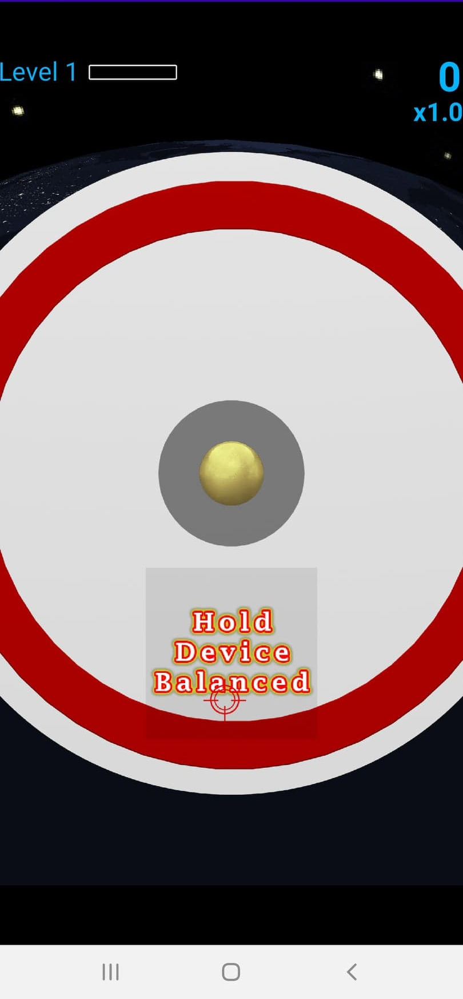
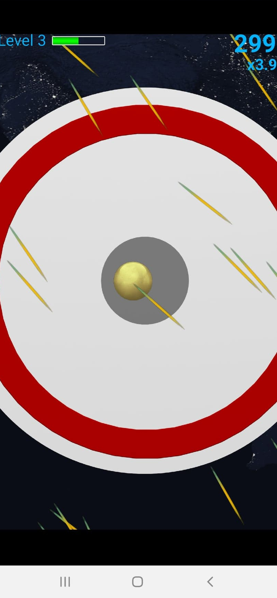
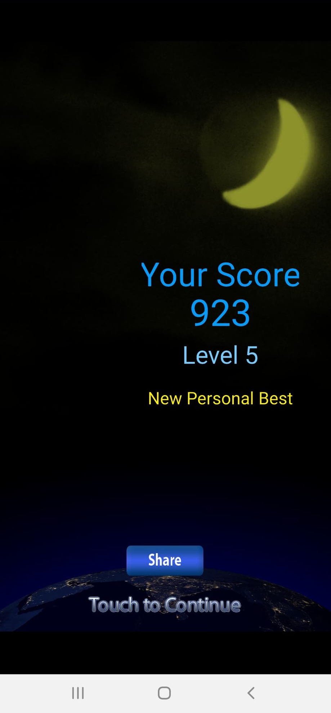
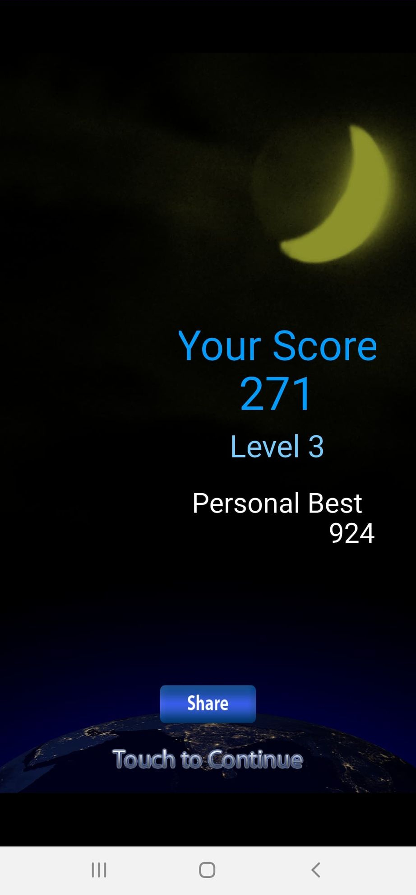

# Balance IT - Space

This project is a refactored code release of my Android game Balance IT - Space. 
I made this game back in 2012, and that version is still [available in the Google Play Store](https://play.google.com/store/apps/details?id=com.renovelabz.balanceit&hl=en_CA).
It is an Android accelerometer sensor-based game that works well even on modern phones. The following video showcases this game.

Having looked at my decade-old code written before my bachelor's, I decided that a public release requires a major code refactoring.
This code repository is a re-implementation of that same game using a better-designed code base. 
So far, I have completed the implementation of the game-play stage and the game-over screen.
The development of menus is future work. 
As before, everything is developed directly on top of the OpenGL ES library available with Android SDK using Java.
I have developed a new game engine layer that implements low-level features, isolating the game code from the Android platform.

The following screenshots are from the newly developed version.

       

The codebase consists of two sections:
 1) [The Game](app/src/main/java/io/github/madhawav/balanceit): Implements the gameplay scene, game over scene and the gameplay logic.
 2) [The Game Engine](app/src/main/java/io/github/madhawav/gameengine): Consists of core game engine which provides onUpdate and onRender calls. The graphics package wraps OpenGL ES 2.0 library using a 3D graphics engine and a sprite engine. Multi-scene package allow swapping between scenes (E.g. gameplay scene, game over scene). The UI package implements common UI elements such as Label, ImageButton, Image etc. 
