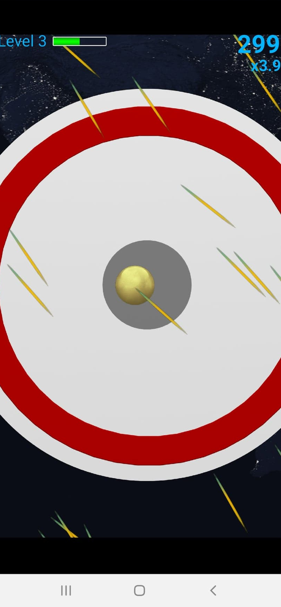
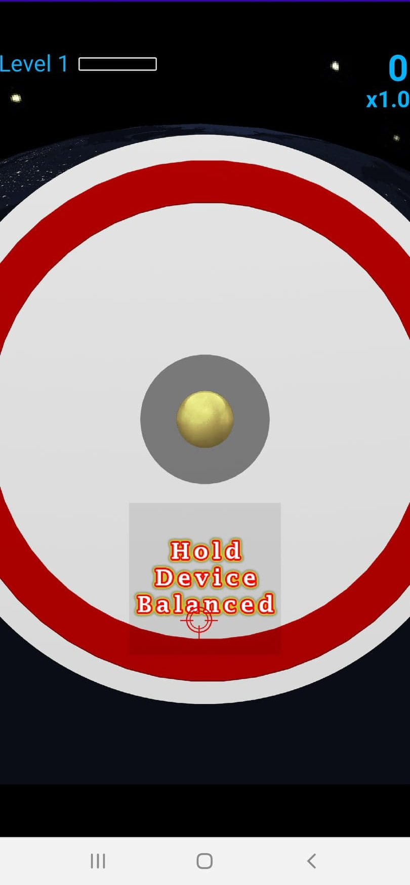

# Balance IT - Space

This project is a refactored code release of my Android game Balance IT - Space. 
I made this game back in 2012-2013, and that version is still [available in the Google Play Store](https://play.google.com/store/apps/details?id=com.renovelabz.balanceit&hl=en_CA).
It is an Android accelerometer sensor based game which works well even in modern phones. 
Having looked at my decade old original code written before my undergraduate studies, I've decided that a public release requires a major code refactor. 

This code repository is a re-implementation of that same game using a better-designed code base. 
So far, I have completed the implementation of game-play stage.
The development of menus is future work. 
As before, everything is developed directly on top of the OpenGL ES library available with Android SDK using Java.
I have added a new game engine layer developed by me to issolate the game code from the platform.

The following is a screenshot from the newly developed version.

    

The codebase consists of two sections:
 1) [The Game](app/src/main/java/io/github/madhawav/balanceit)
 2) [The Game Engine](app/src/main/java/io/github/madhawav/gameengine)
